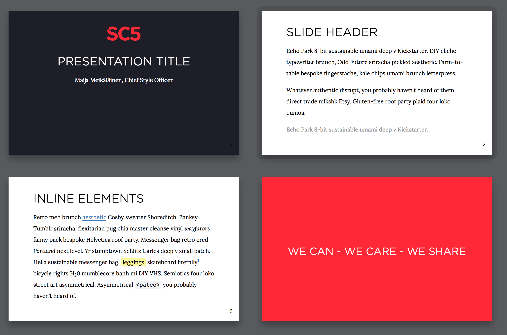

# SC5 theme for Shower 

Default theme for the [Shower](https://github.com/shower/shower/) presentation engine. Doesn’t include engine itself.

[See it in action](https://sc5.github.io/shower-sc5/).

## Usage

Get the Shower template where Ribbon is already included. Download the [template archive](http://shwr.me/shower.zip) or install the package:

	npm install shower

If you want to install Ribbon separately you can download the [theme archive](http://shwr.me/ribbon.zip) or install the package:

	npm install shower-sc5

## Features

All theme’s features are demonstrated in the [index.html](index.html) file. Use it as a reference while building your presentation. See more detailed [features overview](https://github.com/shower/shower/blob/master/docs/features-en.md).

## Ratios

Ribbon theme supports two slide ratios: wide 16×10 (default) and taller 4×3. To change the slide’s ratio include one of the pre-built `screen-16x10.css` or `screen-4x3.css` files in the `<head>` of your presentation.

## PDF

Ribbon could be exported to PDF by printing it from the list mode in Chrome or Opera browsers. See [printing documentation](https://github.com/shower/shower/blob/master/docs/printing-en.md) for more options.

## Development

If you want to adjust theme for your needs:

1. Fork this repository and clone it to your local machine.
2. Install dependencies: `npm install`.
3. Start a local server with watcher: `npm run dev`.
4. Edit your files and see changes in the opened browser.

You can deploy your changes to [https://sc5.github.io/shower-sc5/](https://sc5.github.io/shower-sc5/):

    npm run deploy

To take part in Ribbon development please read [contributing guidelines](CONTRIBUTING.md) first and [file an issue](https://github.com/shower/shower/issues/new) before sending any pull request.

---
Licensed under [MIT License](LICENSE.md).
